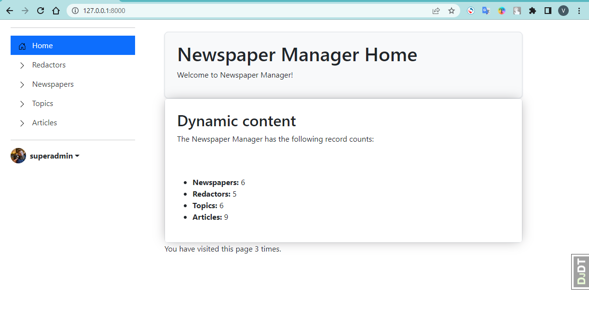

# Newspaper-agency

The application is a system for tracking redactors, assigned to newspapers and publications in these. 
So agency chief will always know, who were the publishers of each newspaper, what and when were publicated.

### Installation
1. To work with the project, you must have python 3.8 or higher installed.
2. Clone the forked repo
    ```
    git clone https://github.com/vadim-kosnovskiy/newspaper-agency.git
    ```
3. Open the project folder.
4. Install all of the Python modules and packages listed in requirements.txt file to your environment
   ```
   python -m venv venv
   venv\Scripts\activate (on Windows)
   source venv/bin/activate (on macOS) 
   pip install -r requirements.txt
   ```

### Features

- Redactors
- Newspapers
- Topics
- Articles


### Example

[Newspaper Agency project deployed to Render](https://newspaper-agency-ec2a.onrender.com)

You can view the site as a test user: 

Login: `user`

Password: `user12345`

