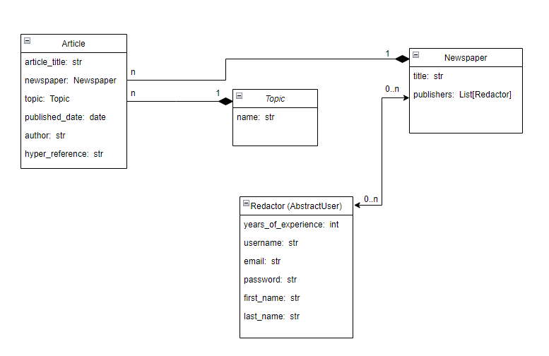
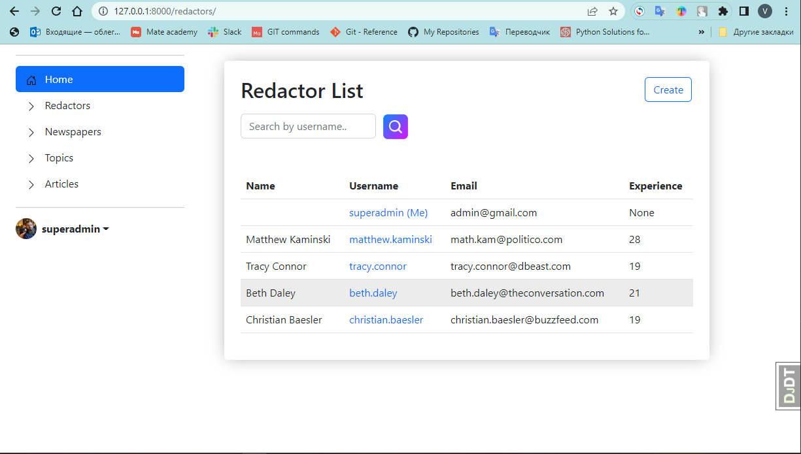
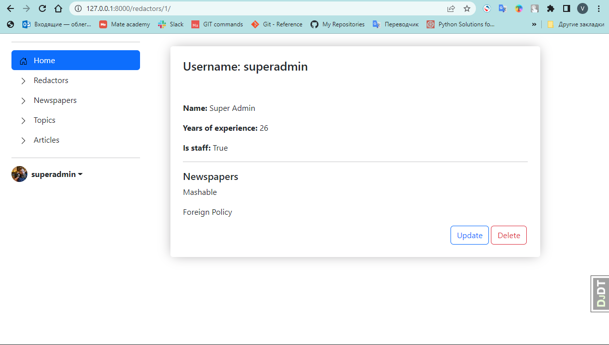
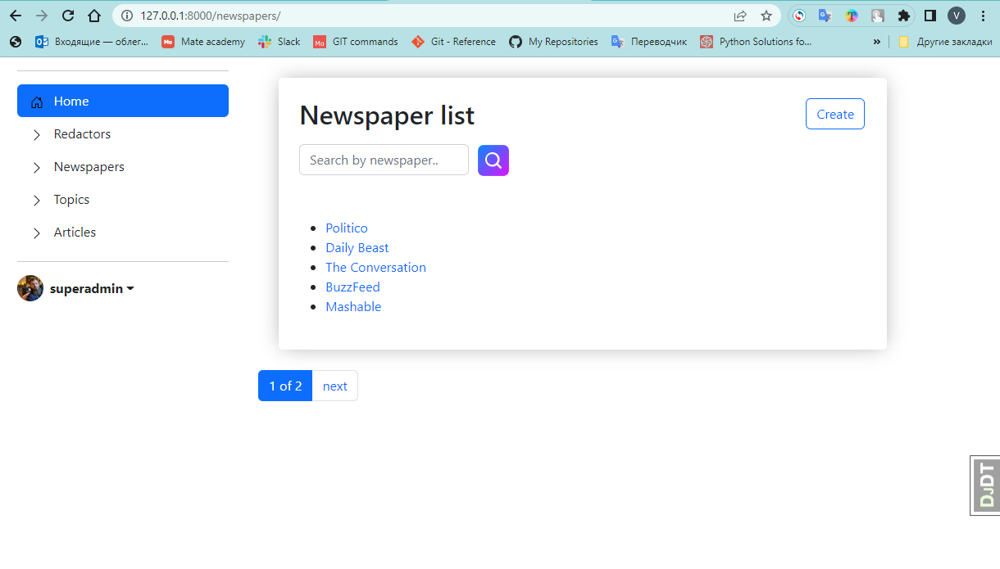
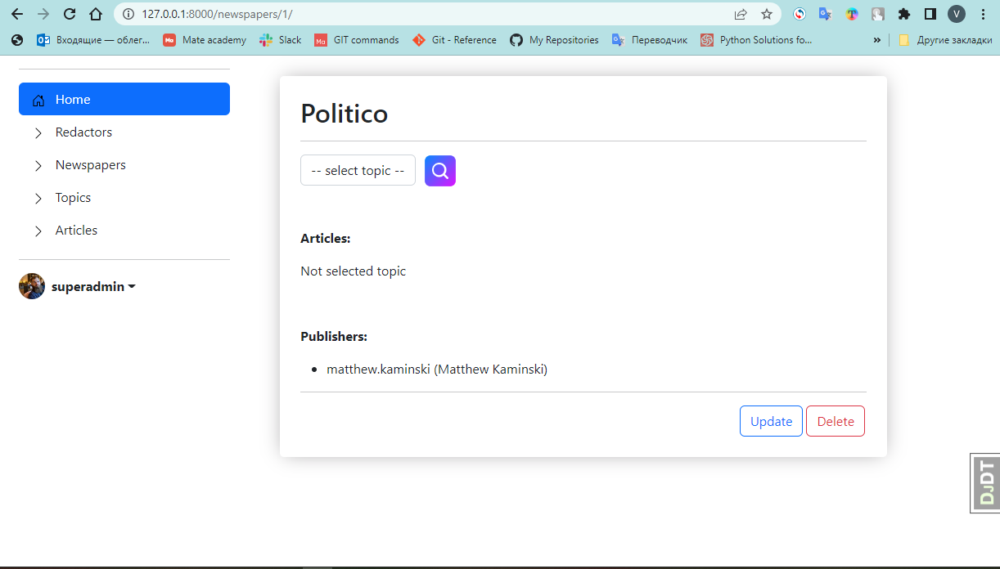
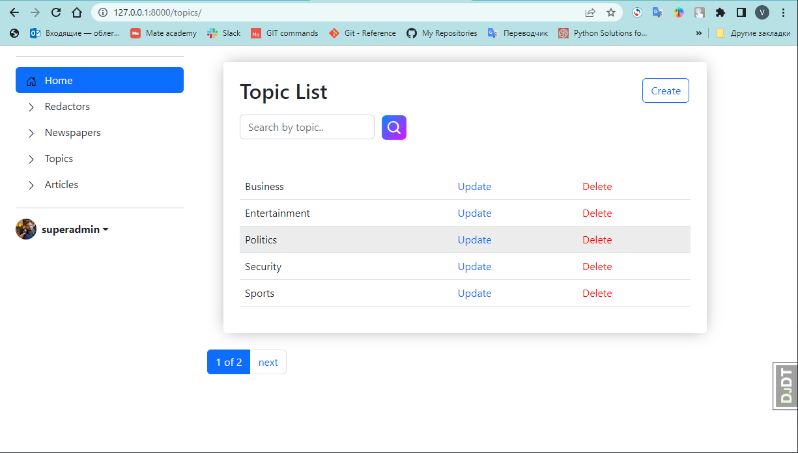
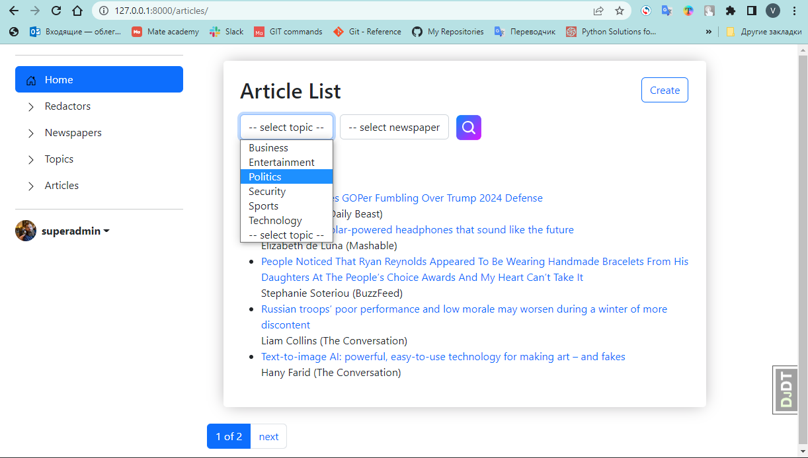
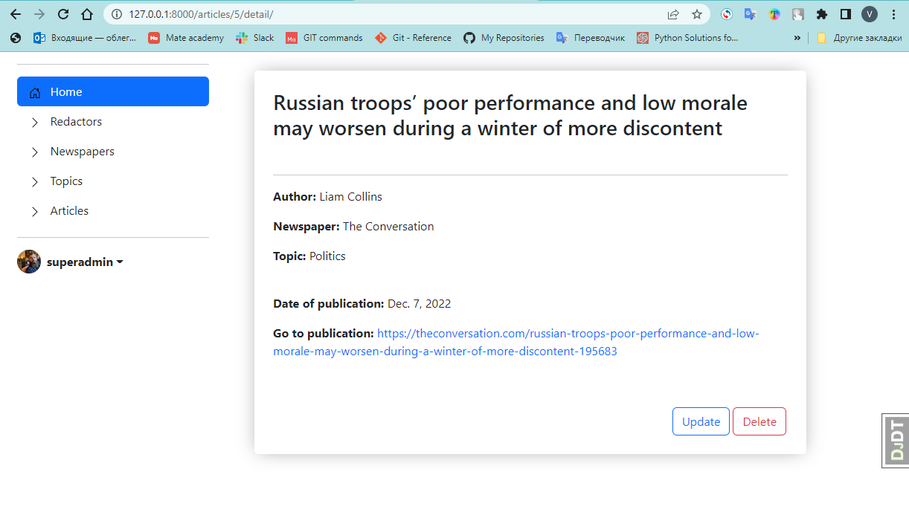

# Newspaper-agency

The application tracks editors and newspaper postings.

### Installation
1. To work with the project, you must have python 3.8 or higher installed.
2. Clone the forked repo
    ```
    git clone https://github.com/vadim-kosnovskiy/newspaper-agency.git
    ```
3. Open the project folder.
4. Install all of the Python modules and packages listed in requirements.txt file to your environment
   ```
   python -m venv venv
   venv\Scripts\activate (on Windows)
   source venv/bin/activate (on macOS) 
   pip install -r requirements.txt
   ```
   
#### Model diagram


#### Screenshots

Home page


Redactors page


Redactor detail page


Newspapers page


Newspaper detail page


Topics page


Articles page


Article detail page

